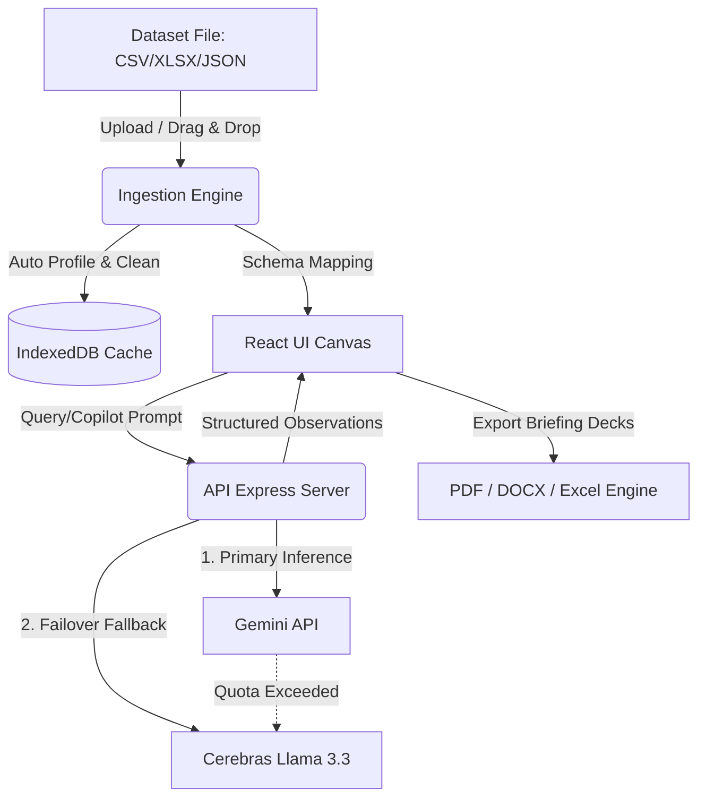

<p align="center">
  
</p>

<p align="center">
  <b>A premium AI-powered business intelligence workspace for instant dataset profiling, audit compliance, and interactive visual reporting.</b>
</p>

<p align="center">
  <a href="https://github.com/26Utkarsh/insightflow/stargazers">
    
  </a>
  <a href="https://github.com/26Utkarsh/insightflow/network/members">
    
  </a>
  <a href="https://github.com/26Utkarsh/insightflow/blob/main/LICENSE">
    
  </a>
</p>

---

## 📸 Product Interface Grid

<div align="center">
  <table border="0" cellspacing="0" cellpadding="0">
    <tr>
      <td width="33%" align="center" valign="top">
        <h3>📥 1. Ingestion</h3>
        <p>Drag-and-drop CSV, Excel, or JSON. InsightFlow automatically runs schema profiling, handles missing values, removes duplicates, and standardizes formats instantly.</p>
      </td>
      <td width="33%" align="center" valign="top">
        <h3>📊 2. Canvas Panel</h3>
        <p>Explore your business data in an interactive dashboard featuring dynamic charts, customizable dimensions, and real-time filtering powered by Recharts.</p>
      </td>
      <td width="33%" align="center" valign="top">
        <h3>🤖 3. AI Copilot</h3>
        <p>Gain deep context observations. Backed by a dual-engine LLM structure (Gemini + Cerebras fallback) for uninterrupted synthesis, audit reports, and summaries.</p>
      </td>
    </tr>
  </table>
</div>

---

## 🛠️ Tech Stack & Integration

<p align="center">
  <a href="https://skillicons.dev">
    
  </a>
</p>

* **Core Core**: React 18, TypeScript, Vite, Tailwind CSS v4
* **State Management**: Zustand with local IndexedDB persistence
* **Visualizations**: Responsive Recharts graphs
* **Inference Engines**: Google Gemini (Primary) & Cerebras Llama 3.3 (Fallback)
* **Export Suites**: ExcelJS, PDF (jsPDF), DOCX export, and HTML2Canvas

---

## ⚡ Visual Highlights & Features

| Feature | Description |
| :--- | :--- |
| ⚡ **Dual AI Engine** | Primary inference via Gemini with automatic failover to Cerebras Llama 3.3 for high availability. |
| 🧹 **Auto Data Cleaning** | Detects and resolves missing records, anomalous numbers, and duplicate stamps during ingestion. |
| 🎨 **Bespoke UI** | Premium light-first styling default, ambient botanical line-art viewport backgrounds, Satoshi typography, and fluid transitions. |
| 📁 **Local-First Storage** | Fully persisted client history and active catalogs using IndexedDB for maximum speed and security. |
| 📈 **Rich Visual Charts** | Interactive metrics rendering using responsive Recharts, grouped by custom dimensions. |
| 🖨️ **Print-Ready Briefs** | Export professional PDFs, Excel sheets, and print layouts with one-click operations. |

<br/>

<details>
<summary><b>🛠️ System Architecture & Data Flow (Click to Expand)</b></summary>


</details>

---

## 🚀 Getting Started

### 📦 Local Installation

```bash
# Clone the repository
git clone https://github.com/26Utkarsh/insightflow.git
cd insightflow

# Install node dependencies
npm install

# Start local server and frontend watch
npm run dev
```

Open `http://localhost:3000` to start exploring.

### ⚙️ Environment Configuration

Create a local `.env` file at the root level:

```bash
# Primary AI API (Required)
GEMINI_API_KEY=your_gemini_api_key_here
GEMINI_MODEL=gemini-3.5-flash

# Fallback AI API (Optional)
CEREBRAS_API_KEY=your_cerebras_api_key_here
CEREBRAS_MODEL=llama-3.3-70b
```

---

## 📊 Developer Profile

<div align="center">
  
</div>

<p align="center">
  
</p>

<p align="center">
  <a href="https://github.com/26Utkarsh/insightflow">
    
  </a>
</p>
